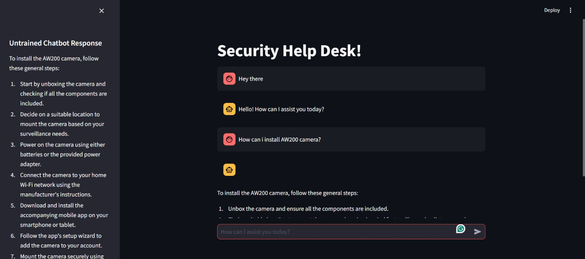

# Chatbot

**Punchline:** A chatbot that reads documents, web pages, CSV files, and text files to provide answers based on the loaded content using OpenAI, LangChain, and FAISS.

## Description

This project is a Streamlit web application that serves as a chatbot capable of reading and understanding various document formats including PDFs, text files, and CSV files. It leverages OpenAI's GPT models, LangChain for document processing, and FAISS for vector storage and retrieval to provide accurate and context-aware responses to user queries.

## Table of Contents

- [Installation](#installation)
- [Usage](#usage)
- [Demo](#demo)
- [Results](#results)
- [Contributing](#contributing)
- [License](#license)
- [Acknowledgements](#acknowledgements)

## Installation

To get this project up and running on your local machine, follow these steps:

1. Clone the repository:

    ```bash
    git clone https://github.com/yourusername/Chatbot.git
    cd Chatbot
    ```

2. Create and activate a virtual environment (optional but recommended):

    ```bash
    python -m venv venv
    source venv/bin/activate  # On Windows use `venv\Scripts\activate`
    ```

3. Install the required packages:

    ```bash
    pip install -r requirements.txt
    ```

4. Ensure you have an OpenAI API key and add it to a `.env` file in the root directory:

    ```
    OPENAI_API_KEY=your_openai_api_key
    ```

5. Run the Streamlit app:

    ```bash
    streamlit run app.py
    ```

## Usage

1. Open your web browser and go to the URL provided by Streamlit (typically `http://localhost:8501`).
2. The application will process the files specified in `file_paths` within the `app.py` script.
3. Interact with the chatbot by entering your queries in the input box.

## Demo

Here are some screenshots of the application in action:



## Results

The chatbot processes the provided documents and files to offer accurate responses. If it cannot find the information in the provided documents, it defaults to using GPT-3.5-turbo to generate a response.

## Contributing

If you want to contribute to this project, follow these steps:

1. Fork the repository.
2. Create a new branch.
3. Make your changes.
4. Submit a pull request.

## License

This project is licensed under the MIT License - see the [LICENSE](LICENSE) file for details.

## Acknowledgements

- Thanks to the creators of Streamlit, OpenAI, LangChain, and FAISS for their excellent tools and libraries.
- Special thanks to all contributors and users who provide feedback and support.

